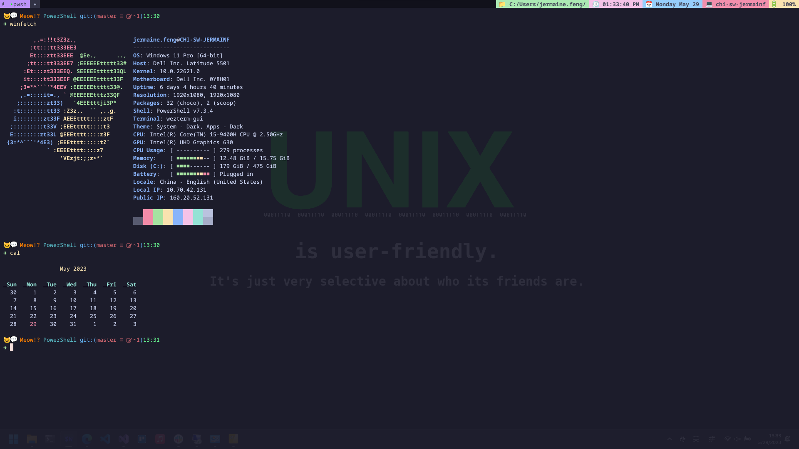
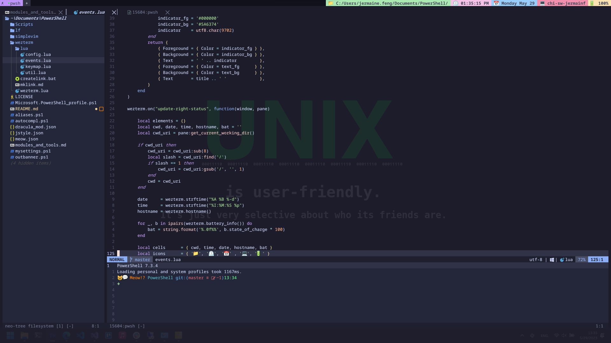
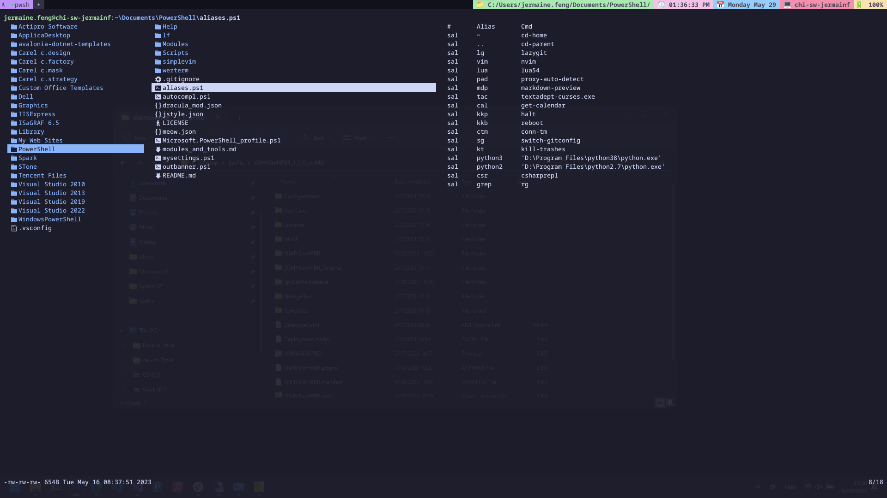

# General

First of all, these configurations are only for my own use. Current there're three parts configurations:
- Vim
- Wezterm
- PowerShellCore Profile.

Configuraitons on different platforms support:
- Vim: Windows and Linux
- Wezterm: Windows and Linux
- PowerShellCore profile: Windows only

# How to use
The most important thing at first is to back up all your configurations on Vim, Wezterm and PowerShellCore Profile.

## For windows users

Clone this repo into $PROFILE parent directory, execute following command in powershell.
```powershell
$mydocuments = [environment]::getfolderpath([environment+specialfolder]::mydocuments)
cd $mydocuments
git clone https://github.com/BigThxBrigde/mypwshprofile PowerShell
```

Create links for Wezterm
```batch
@echo off
pushd "%USERPROFILE%"
if exist .wezterm.lua del /f /q .wezterm.lua
if exist .wezterm rmdir /q .wezterm
mklink .wezterm.lua "%USERPROFILE%\Documents\Powershell\wezterm\wezterm.lua"
mklink /D .wezterm "%USERPROFILE%\Documents\PowerShell\wezterm\lua"
popd
```

Create links for Vim
```batch
@echo off
pushd "%LOCALAPPDATA%"
if exist nvim rmdir /q nvim
mklink /D nvim "%USERPROFILE%\Documents\PowerShell\simplevim"
popd
```

## For Linux users
Ignore the PowerShellCore Profile, clone the repo into `$YOUR_PATH`
```bash
git clone https://github.com/BigThxBrigde/mypwshprofile $YOUR_PATH/PowerShell
```

Create links for Wezterm
```
mkdir -p $HOME/.config/wezterm
cd $HOME/.config/wezterm
ln -sv $YOUR_PATH/PowerShell/wezterm/wezterm.lua wezterm.lua
ln -sv $YOUR_PATH/PowerShell/wezterm/lua/config.lua config.lua
ln -sv $YOUR_PATH/PowerShell/wezterm/lua/events.lua events.lua
ln -sv $YOUR_PATH/PowerShell/wezterm/lua/keymap.lua keymap.lua
ln -sv $YOUR_PATH/PowerShell/wezterm/lua/util.lua util.lua
```

Create links for Vim
```bash
cd $HOME/.config
ln -sv $YOUR_PATH/PowerShell/simplevim nvim
```

Add `SIMPLEVIM` into your .zshrc or .bashrc, etc
```
export SIMPLEVIM=$YOUR_PATH/PowerShell/simplevim
```

# Package Manager
- [winget](https://github.com/microsoft/winget-cli)
- [chocolatey](https://chocolatey.org/)
- [scoop](https://scoop.sh/)

# Installed modules and scripts
- [PowerShellGet](https://github.com/PowerShell/PowerShellGet)
- [PSCalendar](https://github.com/jdhitsolutions/PSCalendar)
- [Profiler](https://github.com/nohwnd/Profiler)
- [PSReadLine](https://github.com/PowerShell/PSReadLine)
- [Terminal-Icons](https://github.com/devblackops/Terminal-Icons)
- [z](https://github.com/badmotorfinger/z)
- [winfetch](https://github.com/lptstr/winfetch)

# Installed Tools
- [gsudo](https://github.com/gerardog/gsudo)
- [oh-my-posh](https://ohmyposh.dev/)
- [nba-cli](https://github.com/dylantientcheu/nbacli)
- [bat](https://github.com/sharkdp/bat)
- [btop](https://github.com/aristocratos/btop)
- [lf](https://github.com/gokcehan/lf)
- [lazygit](https://github.com/jesseduffield/lazygit)
- [ripgrep](https://github.com/BurntSushi/ripgrep)
- [wezterm](https://wezfurlong.org/wezterm/index.html)
- [C# REPL](https://fuqua.io/CSharpRepl/)

Refer to [modules and tools](modules_and_tools.md)

# Screenshot




```
